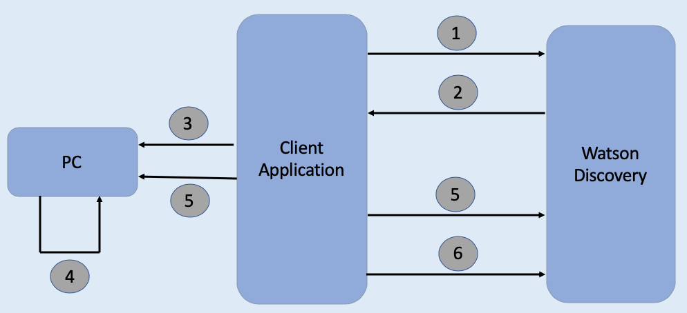

# Work-in-progress

# Improve Watson Discovery Results using API based Relevancy Training

Developers use the IBM Watson Discovery service to rapidly add a cognitive, search, and content analytics engine to applications. With that engine, they can identify patterns, trends, and insights from unstructured data that drive better decision making. With Watson Discovery, you can *ingest* (convert, enrich, clean, and normalize), store, and query data to extract actionable insights. In order to search and query, you need content that is injected and persisted in collections. You can learn more about developing applications with Watson Discovery by studying the [Cognitive discovery reference architecture](https://www.ibm.com/cloud/architecture/architectures/cognitiveDiscoveryDomain). 

Relevancy Training is a powerful capability in Watson Discovery Service that can improve search accuracy if the right approach is taken. You can train Discovery to improve the relevance of query results for your particular organization or subject area. When you provide a Discovery instance with *training data*, the service uses machine-learning Watson techniques to find signals in your content and questions. The service then reorders query results to display the most relevant results at the top. As you add more training data, the service instance becomes more accurate and sophisticated in the ordering of results it returns.

Relevancy training is optional; if the results of your queries meet your needs, no further training is necessary. For an overview of building use cases for training, see the blog post [How to get the most out of Relevancy Training](https://developer.ibm.com/dwblog/2017/get-relevancy-training/).

Relevancy training in Watson Discovery can be done in two ways as follows:

- Using Tooling. See [Improving result relevance with the tooling](https://cloud.ibm.com/docs/discovery?topic=discovery-improving-result-relevance-with-the-tooling) for more details. 
- Using APIs. Watson Discovery provides APIs for performing Relevance Training. 

If your Watson Discovery instance has fairly large number of questions for which relevance training needs to be done, then the tooling method might take much longer compared to the programattic (using APIs) way. Also using APIs one need not be online connected to Discovery instance via browser.

This Code Pattern shows, with an example, how relevancy training can be achieved using APIs.


# Flow



1. Client application sends natural language query for each of the queries that needs relevance training.
2. Watson Discovery return passages for each of the natural language queries made.
3. The client application saves queries and corresponding passages in a TSV file, on local machine.
4. User adds weightages to passages and saves the file.
5. Client application then uses updated weightages to invoke Discovery relevance training APIs.
6. Client can then query Discovery service to retrieve improved results for queries.


# Pre-requsites

- [IBM Cloud Account](https://cloud.ibm.com/)
- [Python](https://www.python.org/downloads/) installed on your pc

# Steps

Follow these steps to setup and run this code pattern. The steps are described in detail below.

1. [Create Discovery service instance](#1-create-discovery-service-instance)
2. [Get the code](#2-get-the-code)

## 1. Create Discovery service instance

If you already have an instance of Discovery service instance, then skip this step and jump to [step 2](#2-get-the-code).

- Login to your [IBM Cloud](https://cloud.ibm.com/) account

- Click `Catalog`. Search for `Discovery`. And click on `Discovery` service from the searched list.

  

- Under `Create` tab, select a region, select a plan, and edit `service name`, if required. Then click `Create`.
- Go to IBM Cloud Dasboard and navigate to the newly created Discovery service under `Services` and click on it. 
- Click on `Launch Watson Discovery`
- 

## 2. Get the code 

Clone the repo using the below command.

```python
git clone git@github.com:IBM/improve-discovery-results-using-api-based-relevancy-training.git
```

# Related Links

- https://developer.ibm.com/dwblog/2017/get-relevancy-training/
- 