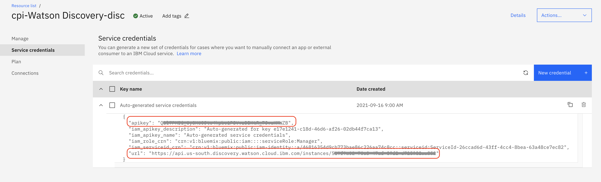
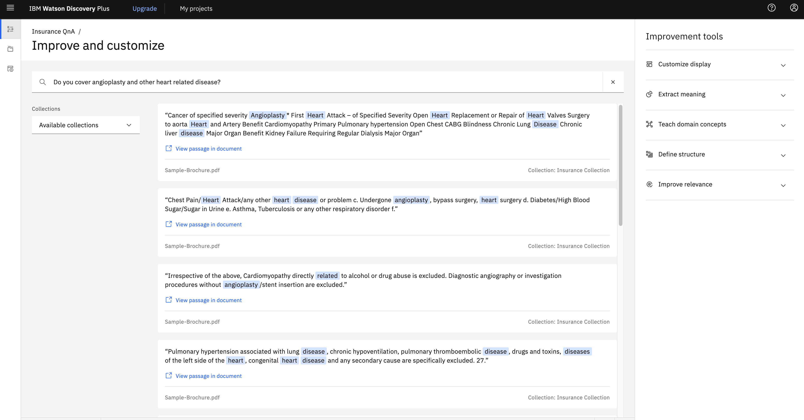

# Improve Watson Discovery Results using API based Relevancy Training

Developers use the IBM Watson Discovery service to rapidly add a cognitive, search, and content analytics engine to applications. With that engine, they can identify patterns, trends, and insights from unstructured data that drive better decision making. With Watson Discovery, you can *ingest* (convert, enrich, clean, and normalize), store, and query data to extract actionable insights. In order to search and query, you need content that is injected and persisted in collections. You can learn more about developing applications with Watson Discovery by studying the [Cognitive discovery reference architecture](https://www.ibm.com/cloud/architecture/architectures/cognitiveDiscoveryDomain). 

Relevancy Training is a powerful capability in Watson Discovery Service that can improve search accuracy if the right approach is taken. You can train Discovery to improve the relevance of query results for your particular organisation or subject area. When you provide a Discovery instance with *training data*, the service uses machine-learning Watson techniques to find signals in your content and questions. The service then reorders query results to display the most relevant results at the top. As you add more training data, the service instance becomes more accurate and sophisticated in the ordering of results it returns. Check [Improving result relevance with training](https://cloud.ibm.com/docs/discovery-data?topic=discovery-data-train) for more details.

Relevancy training is optional; if the results of your queries meet your needs, no further training is necessary. For more information about when to use relevancy training, read the [Relevancy training for time-sensitive users](https://medium.com/ibm-data-ai/ibm-watson-discovery-relevancy-training-time-sensitive-18a190b0874a) blog post on Medium.

Relevancy training in Watson Discovery can be done in two ways as follows:

- Using Tooling. See [Improving result relevance with the tooling](https://cloud.ibm.com/docs/discovery?topic=discovery-improving-result-relevance-with-the-tooling) for more details. 
- Using APIs. Watson Discovery provides APIs for performing Relevance Training. 

If your Watson Discovery instance has fairly large number of questions for which relevance training needs to be done, then the tooling method might take much longer compared to the programmatic (using APIs) way. Also, for using APIs, one need not be online connected to Discovery instance via browser.

This Code Pattern shows, with an example, how relevancy training can be achieved using APIs.

## Flow

 

1. Client application sends natural language query for each of the queries that needs relevance training.
2. Watson Discovery return passages for each of the natural language query made.
3. The client application saves queries and corresponding passages in a TSV file, on local machine.
4. User assigns relevancy scores to documents and saves the file.
5. Application accesses file with updated relevancy scores.
6. Client application invokes APIs to update Discovery collection training using updated relevancy scores.
7. Client queries again to get improved results.

## Prerequsites

- [IBM Cloud Account](https://cloud.ibm.com/).
- [Python](https://www.python.org/downloads/), version preferably > 3.7,  installed on your PC.
- Basic familiarity of [IBM Cloud](https://cloud.ibm.com/) and [Discovery service](https://www.ibm.com/cloud/watson-discovery).
- [git client](https://git-scm.com/downloads).

## Steps

Follow these steps to setup and run this code pattern. The steps are described in detail below.

1. [Create Discovery service instance on IBM Cloud](#1-create-discovery-service-instance-on-ibm-cloud)
2. [Create a project in Watson Discovery](#2-create-a-project-in-watson-discovery)
3. [Annotate Documents](#3-annotate-documents)
4. [Prepare the code to run relevancy training APIs](#4-prepare-the-code-to-run-relevancy-training-apis)
5. [Relevance Training](#5-relevance-training)
   

### 1. Create Discovery service instance on IBM Cloud

- Login to your [IBM Cloud](https://cloud.ibm.com/) account.

- Click `Catalog`. Search for `Discovery`. Click on `Discovery` service from the list shown.

  

**Under `Create` tab**
1. select a region, you may select any region suggested to select a region nearest to you.
2. select the Plus plan or the Premium plan. Discovery V2 APIs, which are used in the code pattern, are available as part of Plus plan or the Premium plan.
3. Edit `service name`, if required. You may keep it to its default value.
4. Click `Create`. 
An instance of Watson Discovery Service will be created. Make a note of the credentials of the Discovery instance created. `apikey` and `url` will be used later in this code pattern.



### 2. Create a project in Watson Discovery
- Launch Watson Discovery service you created.
- On the Watson Discovery home page, click `New project`.
- Enter a project name and select `None of the above — I’m working on a custom project` option and click `Next`. We will not use any existing template to create a project.
- Click on/select `Upload data` and click `Next`.
- Enter a name for your Collection. Click `Next`.
- Upload the file `cloned repo parent folder/docs/Sample-Brochure.pdf`. This is a sample life insurance document. Wait for a couple of seconds for a pop up message to appear on the top right corner of your browser. 

- Click `Finish`. It will take a few seconds for the document to be ingested.
- You may test the collection by querying it.

Note that in real scenarios there will be many documents and most relevant documents are listed in the beginning. In this code pattern, we will split this document into multiple documents, based on headers or subtitles. The query then will fetch results from different (split) documents in the order of relevancy.


### 3. Annotate Documents
[Smart Document Understanding (SDU)](https://cloud.ibm.com/docs/discovery?topic=discovery-sdu) trains IBM Watson Discovery to extract custom fields in your documents. Customising how your documents are indexed into Discovery may improve the answers that your application returns.

With SDU, you annotate fields within your documents to train custom conversion models. As you annotate, Watson is learning and starts to predict annotations. 

- On Discovery home page, click `Manage Collections`.


- Click on the collection tile for the collection that was created while creating the Discovery project.
- Click on `Identify fields` tab and select `User-trained models`. Click `Submit`.
- Click `Apply changes and reprocess` button on top right.

SDU annotation page opens and you need to annotate the documents here. Annotate various fields in the document. Especially the text and subtitles. Subtitles will be used to split the document. Refer [this demonstration video](https://www.youtube.com/watch?v=onxgZ6uCZ9o) for understanding SDU, if required. Following are some of the annotations done for the document ingested.

  

- After annotating each page click on `Submit` button.

- When annotation is done for all the required pages in the document, click `Apply changes and reprocess`. 

- Click on `Manage fields` tab. Enable the fields that are needed and disable the fields that are not needed. Under `Improve query results by splitting your documents` select the field, `subtitle`, for splitting the document.


- Again, click `Apply changes and reprocess`.

- Wait for a couple of minutes and refresh the page. Click on the `Activity` tab. The total number of documents should be changed from 1 to anything about more than 100 depending on the subtitles that you have marked.

Now that the documents are ingested, we can do natural language query and get results. Subsequent steps will show how to query.
  

### 4. Prepare the code to run relevancy training APIs
**Get the code**

Clone the repo using the below command on a terminal window.
```
git clone git@github.com:IBM/improve-discovery-results-using-api-based-relevancy-training.git
```

**Get Discovery project_id and collection_id**

To run APIs we will need project_id and collection_id.
Get project_id using by running the below command on a terminal

```
curl -u "apikey:<apikey>" "<url>/v2/projects?version=2020-08-30"
```

Use the project_id to get collection_id

```
curl -u "apikey:<apikey>" "<url>/v2/projects/<project_id>/collections?version=2020-08-30"
```

Edit the file `Cloned repo parent folder/DiscoveryDetails.py` and update the following:
- **project_id and collection_id** as noted above
- **apikey and url** as noted when Discovery instance was created
- **version** as mentioned in https://cloud.ibm.com/apidocs/discovery-data#versioning. At the time of writing this document, the version is '2020-08-30'

Save the DiscoveryDetails.py file.

### 5. Relevance Training

As mentioned previously, in this code pattern we will send queries to Discovery using APIs. The purpose of this code pattern is to show how you can achieve relevance training for a large set of questions. On a high level, following are the steps

1. Get results/documents for all the natural language queries. 
2. Assign/update relevance scores to documents.
3. Train Discovery with new relevance scores of documents.

#### 5.1 Get results for all the natural language queries

Let us begin with querying discovery and getting results without any additional training. For this make a list of questions based on the dataset/document ingested into Discovery. Ensure that you have at least 49 questions, to cater to minimum queries required by Discovery for training purpose.

Place all the questions in a text file. Each question must be line separated. In our case the questions are placed in `<Repo Parent Directory>/Questions.txt`. 

Install required python modules by running following command:

```py
pip3 install -r requirements.txt
```

Let us train Discovery with all these questions/queries. Run the following command
```
python Query.py
```

This command queries Discovery for every question appearing in `Questions.txt` file. The command might take a few minutes depending on the number of questions. Results of queries are saved in a file named `<Repo Parent Directory>/training_file.tsv`. It is a `.tsv (Tab Separated Value)` file in the following format:


- First column of each row is natural language query.
- Next columns, in sets of 3 columns, are document_id of document, text of document and a blank tab respectively for each of the passages of query results.
- The blank tab is left as a filler to enter relevancy score for the document_id, appearing 2 columns back in the row.

Ensure that  `training_file.tsv` is created and has required data. A sample .tsv file created and viewed in Microsoft Excel is as shown below:


> You might encounter an error (And will be logged as part of running the Query.py) `It is required that you pass in a value for the "algorithms" argument when calling decode()` then the issue could be due to PyJWT version. Check your PyJWT version, if it is > 2.0.0, then downgrade the version to <2.0.0 and try. This should fix the above error.

Before we further train Discovery, let us make a note of the results that Discovery provides, by default. For this run a sample natural language query in Discovery tool. Navigate to `Watson Discovery Dashboard` > Click on your project tile > Run a query by entering your query in search field and hitting enter.

A sample query and it's results are as in following image. Later we will mark these documents/results as relevant or not relevant and we will see that if the documents retrieved for this query is as per we marked them.


#### 5.2 Assign relevance scores

**Relevance Score**: The relevance score for each training query must be a non-negative integer, for example `0` to represent *not relevant*, `1` to represent *somewhat relevant*, and `2` to represent *highly relevant*. However, for maximum flexibility, the service accepts non-negative integers between `0` and `100` for advanced users experimenting with different scoring schemes. Regardless of the range you use, the largest integer in the set of training queries indicates maximum relevance.

Open the `training_file.tsv` file using an editor such as Microsoft Excel for a better visual representation. For each query and document id, update relevance score. Provide relevance for each passage or else by default relevance score of 0 (not relevant) is assumed. Save the file when all the queries and document_ids are assigned relevant scores.

Few sample rows after relevance scores are assigned looks as below


#### 5.3 Update Discovery with new relevance scores

Now that the query results are assigned with relevance scores, we need to update these scores back to Discovery collection for updating the training data.

We will do this by running the following command from cloned repo's parent folder.

```
python RelevanceTraining.py
```

>  You might see `ApiException (Error Code: 409)` entries in the logs. You can safely ignore these errors since these errors occur because the training examples were already available. The code will internally delete those training examples and update with new ones.

When the command completes the run, it would have updated the training with relevant results for our queries.

Note that the service uses machine-learning Watson techniques to find signals in your content and questions. The service may reorder query results to display the most relevant results at the top. As you add more training data, the service instance may become more accurate and sophisticated in the ordering of results it returns. Refer to [Relevancy training for time-sensitive users](https://medium.com/ibm-data-ai/ibm-watson-discovery-relevancy-training-time-sensitive-18a190b0874a) blog post on Medium for detailed explanation on how relevancy training might help.


#### 5.4 Check Training Status

Next, we need to check status of Discovery training. Run the below command to check the status.

```
python CheckStatus.py
```

You will see output similar to

```
{
  "project_id": "xxxxxxxxxxxx",
  "type": "other",
  "name": "Relevancy Training",
  "collection_count": 1,
  "relevancy_training_status": {
    "data_updated": "2021-10-07T10:20:26.346Z",
    "total_examples": 688,
    "sufficient_label_diversity": true,
    "processing": false,
    "minimum_examples_added": true,
    "available": true,
    "notices": 0,
    "minimum_queries_added": true
  },
  "default_query_parameters": {
    "aggregation": "",
    "count": 10,
    "sort": "",
    "return": [],
    "passages": {
      "enabled": true,
      "count": 10,
      "fields": [
        "text",
        "title"
      ],
      "characters": 200,
      "per_document": true,
      "max_per_document": 1,
      "find_answers": false,
      "max_answers_per_passage": 1
    },
    "highlight": false,
    "spelling_suggestions": false,
    "table_results": {
      "enabled": true,
      "count": 10,
      "per_document": 0
    },
    "suggested_refinements": {
      "enabled": false,
      "count": 10
    }
  }
}
```

Ensure that the training status shows values as shown in below image.

 

Ensure that `Processing` field should be `false`, `available` field should be `true`, meaning that the processing is completed successfully. 

Now check if the documents retrieved for queries are as per relevance scores updated. We will run the same query that we had run earlier and see if the documents marked as relevant have been prioritised in the result for the query. We may notice that documents marked with higher relevance scores may be prioritised over documents marked with lower relevancy scores, as shown in below image. Note that this may not be always true since Watson uses training data to learn patterns and to generalise, not to memorise individual training queries. If that is the case then more training might help learn the model and get desired output.




## Conclusion

You can train Discovery to improve the relevance of query results for your particular organization or subject area. For a fewer set of queries it can be achieved using Watson Discovery tooling. However, for a large set of queries, it is better to use APIs to achieve this. In this code pattern we used Watson discovery collection with the default training and Python code to send requests and process responses. We queried, with about 140 queries. The responses were recorded is a TSV file. Then the responses were marked with relevancy score. Discovery collection was trained again with new relevancy scores and check the results of relevancy training.


## Related Links

- [How to get the most out of Relevancy Training](https://developer.ibm.com/dwblog/2017/get-relevancy-training/)
- [Improving result relevance with the API](https://cloud.ibm.com/docs/discovery?topic=discovery-improving-result-relevance-with-the-api)

