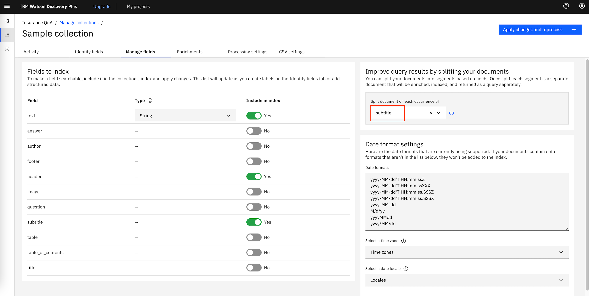
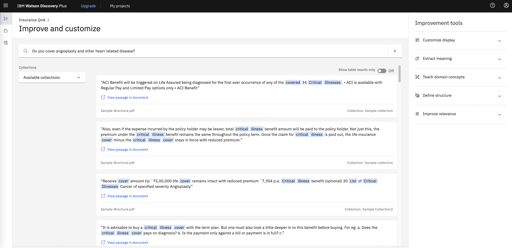

# Work-in-progress

# Improve Watson Discovery Results using API based Relevancy Training

Developers use the IBM Watson Discovery service to rapidly add a cognitive, search, and content analytics engine to applications. With that engine, they can identify patterns, trends, and insights from unstructured data that drive better decision making. With Watson Discovery, you can *ingest* (convert, enrich, clean, and normalize), store, and query data to extract actionable insights. In order to search and query, you need content that is injected and persisted in collections. You can learn more about developing applications with Watson Discovery by studying the [Cognitive discovery reference architecture](https://www.ibm.com/cloud/architecture/architectures/cognitiveDiscoveryDomain). 

Relevancy Training is a powerful capability in Watson Discovery Service that can improve search accuracy if the right approach is taken. You can train Discovery to improve the relevance of query results for your particular organization or subject area. When you provide a Discovery instance with *training data*, the service uses machine-learning Watson techniques to find signals in your content and questions. The service then reorders query results to display the most relevant results at the top. As you add more training data, the service instance becomes more accurate and sophisticated in the ordering of results it returns.

Relevancy training is optional; if the results of your queries meet your needs, no further training is necessary. For an overview of building use cases for training, see the blog post [How to get the most out of Relevancy Training](https://developer.ibm.com/dwblog/2017/get-relevancy-training/).

Relevancy training in Watson Discovery can be done in two ways as follows:

- Using Tooling. See [Improving result relevance with the tooling](https://cloud.ibm.com/docs/discovery?topic=discovery-improving-result-relevance-with-the-tooling) for more details. 
- Using APIs. Watson Discovery provides APIs for performing Relevance Training. 

If your Watson Discovery instance has fairly large number of questions for which relevance training needs to be done, then the tooling method might take much longer compared to the programattic (using APIs) way. Also, for using APIs, one need not be online connected to Discovery instance via browser.

This Code Pattern shows, with an example, how relevancy training can be achieved using APIs.

# Flow

 

1. Client application sends natural language query for each of the queries that needs relevance training.
2. Watson Discovery return passages for each of the natural language query made.
3. The client application saves queries and corresponding passages in a TSV file, on local machine.
4. User assings relevancy scores to documents and saves the file.
5. Client application invokes APIs to update Discovery collection training using updated relevancy scores.
6. Client queries to get improved results.

# Pre-requsites

- [IBM Cloud Account](https://cloud.ibm.com/).
- [Python](https://www.python.org/downloads/), version preferably > 3.7,  installed on your PC.
- Basic familiarity of [IBM Cloud](https://cloud.ibm.com/) and [Discovery service](https://cloud.ibm.com/catalog/services/discovery).

# Steps

Follow these steps to setup and run this code pattern. The steps are described in detail below.

1. [Create Discovery service instance](#1-create-discovery-service-instance)

2. [Annotate Documents](#2-annotate-documents)

3. [Get the Code](#3-get-the-code)

4. [Relevance Training](#4-relevance-training)

5. [Conclusion](#5-conclusion)

   

## 1. Create Discovery service instance

- Login to your [IBM Cloud](https://cloud.ibm.com/) account

- Click `Catalog`. Search for `Discovery`. And click on `Discovery` service from the searched list.

  

- Under `Create` tab, select a region, select a plan, and edit `service name`, if required. Then click `Create`. This should create Watson Discovery Service instance.

- Once the Discovery service instance is created, make a note of it's `apikey` and `url`. These credentails are to be used when we send requests to Discovery service.

  


## 2. Annotate Documents

Smart Document Understanding (SDU) trains IBM Watson™ Discovery to extract custom fields in your documents. Customizing how your documents are indexed into Discovery improves the answers that your application returns.

With SDU, you annotate fields within your documents to train custom conversion models. As you annotate, Watson is learning and starts to predict annotations. SDU models can be exported and used on other collections.

- Go to IBM Cloud Dasboard and navigate to the newly created Discovery service under `Services` and click on it. 

- Click on `Launch Watson Discovery`

- On the Watson Discovery page, click `Upload your own data` . If there is any confirmation message to `Setup with current plan` then click on it. 

- Enter `Collection name` and click `Create`. Collection should be created. 

- Upload the document under docs folder of the cloned [repository](https://github.com/IBM/improve-discovery-results-using-api-based-relevancy-training). Wait till the document is ingested.

- Navigate to the discovery instance that you created and imported the data to. Login to `IBM Cloud` -> `Resource list` -> `Services` -> `Discovery instance` -> `Launch Watson Discovery`.

- Make a note of `Collection ID` and `Environment ID`. They will be used in the code to call the Discovery service.

  

  

- Click `Configure Data` on the top right corner.

  

  

- Annotate various fields in the document. Especially the text and subtitles. Subtitles will be used to split the document. Refer [this demontration video](https://www.youtube.com/watch?v=onxgZ6uCZ9o) for understanding SDU, if required. Following are some of the annotations done for the document ingested.

  

  

- When annotation is done for all the documents, click `Apply changes to collection`. When asked to upload document, upload the same document again.

- Click on `Manage fields` tab. Select the fields that are needed. Under `Improve query results by splitting your documents` select the field, `subtitle`, for splitting the document.

  

  

- Again, click `Apply changes to collection`. When asked to upload document, upload the same document again.

- After a few minutes, the total number of documents should be changed from 1 to anything about more than 100 depending on the subtitles that you have marked.

  Now that the documents are ingested, we can do natural language query and get results. Querying can be done either using the web interface or using APIs. Refer [Discovery APIs](https://cloud.ibm.com/apidocs/discovery/discovery) for more details on APIs.
  
  

## 3. Get the code 

- Clone the repo using the below command on a terminal window.

	```
	git clone git@github.com:IBM/improve-discovery-results-using-api-based-relevancy-training.git
	```

- Change directory to the cloned repo using the command

  ```
  cd improve-discovery-results-using-api-based-relevancy-training
  ```

  And open the file named `DiscoveryDetails.py` in edit mode.

- Edit file named `DiscoveryDetails.py` and update `apikey`, `url`, `collection_id`, `environment_id` which were noted down in earlier steps. Save the file.

  

## 4. Relevance Training

As mentioned previously, in this code pattern we will send queries to Discovery using APIs. The purpose of this code pattern is to show how you can achieve relevance training for a large set of questions. On a high level, following are the steps

1. Get results/documents for all the natural language queries. 
2. Assign/update relevance scores to documents.
3. Train Discovery with new relevance scores of documents.

### 4.1 Get results for all the natural language queries

Let us begin with querying discovery and getting results without any additional training. For this make a list of questions based on the dataset/document ingested into Discovery. Ensure that you have atleast 49 questions, to cater to minimum queries required by Discovery for training purose.

Place all the questions in a text file. Each question must be line separated. In our case the questions are placed in `<Repo Parent Directory>/Questions.txt`. 

Install required python modules by running following commands.

```py
pip3 install -r requirements.txt
```

Let us train Discovery with all these questions/queries. Run the following command
```
python Query.py
```

This command queries Discovery for every question appearing in `Questions.txt` file. The command might take a few minutes depending on the number of questions. Results of queries are saved in a file named `<Repo Parent Directory>/training_file.tsv`. It is a `.tsv (Tab Separated Value)` file in the following format:


- First column of each row is natural language query
- Next columns, in sets of 3 columns, are document_id of document, text of document and a blank tab respectively for each of the passages of query results.
- The blank tab is left as a filler to enter relevancy score for the document_id, appearing 2 columns back in the row.

Ensure that  `training_file.tsv` is created and has required data. 


### 4.2 Check training status

Next, we need to check status of Discovery training. Run the below command to check the status.

```
python CheckStatus.py
```

You will see output similar to

```
Muralidhars-MacBook-Pro-2:improve-discovery-results-using-api-based-relevancy-training muralidhar$ python CheckStatus.py
{
  "collection_id": "e0xxxx-xxx-xxxx-xxxx-xxxxxxxx236",
  "name": "Relevance",
  "configuration_id": "8dxxxxx-xxxx-xxxx-xxxx-xxxxxxx87",
  "language": "en",
  "status": "active",
  "description": null,
  "created": "2020-03-12T05:27:24.489Z",
  "updated": "2020-03-12T05:27:24.489Z",
  "document_counts": {
    "available": 160,
    "processing": 0,
    "failed": 0,
    "pending": 0
  },
  "disk_usage": {
    "used_bytes": 1442596
  },
  "training_status": {
    "data_updated": "2020-03-13T11:40:13.997Z",
    "total_examples": 2159,
    "sufficient_label_diversity": true,
    "processing": false,
    "minimum_examples_added": true,
    "successfully_trained": "2020-03-13T11:49:52.964Z",
    "available": true,
    "notices": 974,
    "minimum_queries_added": true
  },
  "crawl_status": {
    "source_crawl": {
      "status": "not_configured"
    }
  },
  "smart_document_understanding": {
    "enabled": true,
    "total_annotated_pages": 60,
    "total_pages": 60,
    "total_documents": 1,
    "custom_fields": {
      "defined": 0,
      "maximum_allowed": 0
    }
  }
}

```

Ensure that the training status shows values as shown in below image.

 

Once the training is completed, you can run a sample query to get the list of documents. Make a note of results. A sample query and it's results are as in following image. Later we will mark these documents/results as relevant or not relevant and we will see that if the documents retrieved for this query is as per we marked them.




### 4.3 Assign/update relevance scores

**Relevance Score**: The relevance score for each training query must be a non-negative integer, for example `0` to represent *not relevant*, `1` to represent *somewhat relevant*, and `2` to represent *highly relevant*. However, for maximum flexibility, the service accepts non-negative integers between `0` and `100` for advanced users experimenting with different scoring schemes. Regardless of the range you use, the largest integer in the set of training queries indicates maximum relevance.

Open the `training_file.tsv` file using an editor such as excel for a better visual representation. For each query and document id, update relevance score. Provide relevance for each passage or else by default relevance score of 0 (not relevant) is assumed. Save the file when all the queries and document_ids are assigned relevant scores.

Few sample rows after relevance scores are assigned looks as below


### 4.4 Update Discovery with new relevance scores

Now that the query results are assigned with relevance scores, we need to update these scores back to Discovery collection for updating the training data.

We will do this by running the following command from cloned repo's parent folder.

```
python RelevanceTraining.py
```

>  You might see `ApiException (Error Code: 409)` entries in the logs. You can safely ignore these errors since these errors occur because the training examples were already available. The code will internally delete those training examples and update with new ones.

When the command completes the run, it would have updated the training with relevant results for our queries.

Note that the the service uses machine-learning Watson techniques to find signals in your content and questions. The service then reorders query results to display the most relevant results at the top. As you add more training data, the service instance becomes more accurate and sophisticated in the ordering of results it returns.

Now, check the status of training again, as earlier done in section [Check training status](#42-check-training-status). `Processing` field should be false, meaning that the processing is completed. 

Now check if the documents retrieved for queries are as per relevance scores updated. We will run the same query that we had run earlier and see if the documents marked as relevant have been prioritised in the result for the query. We will notice that documents marked with higher relevance scores are prioritised. Note that this may not be always true since Watson uses training data to learn patterns and to generalize, not to memorize individual training queries. If that is the case then more training might help learn the model and get desired output.


## 5. Conclusion

You can train Discovery to improve the relevance of query results for your particular organization or subject area. For a fewer set of queries it can be achieved using Watson Discovery tooling. However, for a large set of queries, it is better to use APIs to achieve this. In this code pattern we used Watson discovery collection with the default training and Python code to to send requests and process responses. We queried, with about 147 queries. The responses were recorded is a TSV file. Then the responses were marked with relevancy score. Discovery collection was trained again with new relevancy scores and we saw the impact on how results were prioritized.

# Related Links

- [How to get the most out of Relevancy Training](https://developer.ibm.com/dwblog/2017/get-relevancy-training/)
- [Improving result relevance with the API](https://cloud.ibm.com/docs/discovery?topic=discovery-improving-result-relevance-with-the-api)

